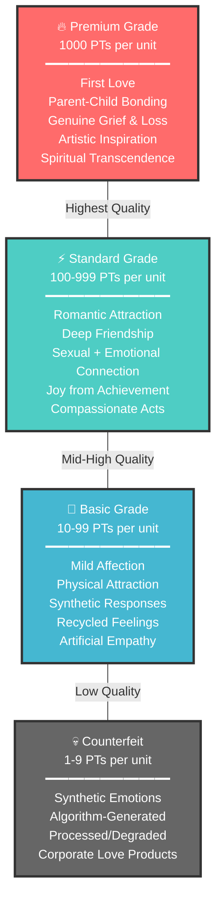

# Hierarchy

```mermaid
graph TB
    A["🔥 Premium Grade<br/>1000 PTs per unit<br/>━━━━━━━━━━━━━━━━<br/>First Love<br/>Parent-Child Bonding<br/>Genuine Grief & Loss<br/>Artistic Inspiration<br/>Spiritual Transcendence"]
    
    B["⚡ Standard Grade<br/>100-999 PTs per unit<br/>━━━━━━━━━━━━━━━━<br/>Romantic Attraction<br/>Deep Friendship<br/>Sexual + Emotional Connection<br/>Joy from Achievement<br/>Compassionate Acts"]
    
    C["💫 Basic Grade<br/>10-99 PTs per unit<br/>━━━━━━━━━━━━━━━━<br/>Mild Affection<br/>Physical Attraction<br/>Synthetic Responses<br/>Recycled Feelings<br/>Artificial Empathy"]
    
    D["💀 Counterfeit<br/>1-9 PTs per unit<br/>━━━━━━━━━━━━━━━━<br/>Synthetic Emotions<br/>Algorithm-Generated<br/>Processed/Degraded<br/>Corporate Love Products"]

    A ---|Highest Quality| B
    B ---|Mid-High Quality| C  
    C ---|Low Quality| D

    style A fill:#ff6b6b,stroke:#333,stroke-width:3px,color:#fff
    style B fill:#4ecdc4,stroke:#333,stroke-width:3px,color:#fff
    style C fill:#45b7d1,stroke:#333,stroke-width:3px,color:#fff
    style D fill:#666,stroke:#333,stroke-width:3px,color:#fff
```

