# FEATURE SPECIFICATION: WHATSAPP DISPATCH FOR [THE_SOCIAL_JETWORKS]
**Doc Identifier:** `DOC-FEAT-WA-001`  
**Status:** `PARKED_FOR_IMPLEMENTATION`  
**Target Module:** `UniversalNewsPane` / `Supabase Edge Functions` / `UserPreferences`  
**Author:** After Dark Protocol Team  

---

## 1. Executive Summary

This specification outlines the technical design to deliver **`[THE_SOCIAL_JETWORKS]`** orbital news dispatches directly to an operator's WhatsApp channel. The system supports:
1. **Authenticated Operator Delivery:** Routing dispatches to the WhatsApp number associated with the active Supabase user profile.
2. **Webpage Visual Fidelity:** Replicating the web terminal aesthetics using both formatted monospace typography and high-DPI rendered CRT canvas images.
3. **Flexible Delivery Triggers:** Both on-demand 1-click dispatches from the web UI and automated scheduled/real-time wire broadcasts.

---

## 2. Visual & Formatting Specifications

To ensure the WhatsApp delivery matches the webpage UI, messages are formatted using a dual-modality strategy.

### 2.1 Monospace Terminal Text Template (WhatsApp Native)
```text
📡 *[THE_SOCIAL_JETWORKS // ORBITAL_WIRE_DISPATCH]*
━━━━━━━━━━━━━━━━━━━━━━━━━━━━━━
📍 *Sector:* {planetOrSector}
⚡ *Urgency:* [ {urgency} // {tag} ]
🕒 *Timestamp:* {formatted12HourDateTime}
━━━━━━━━━━━━━━━━━━━━━━━━━━━━━━

🔥 *{headline}*

```{content}```

🏷️ *Wire:* `{authorOrWire}` | *Protocol:* `AFTER_DARK_V1.0`
```

### 2.2 Visual CRT Terminal Card (Media Message)
- **Source:** Existing canvas generator in [`src/utils/exportNewsImage.ts`](../../src/utils/exportNewsImage.ts).
- **Execution:** When media dispatch is enabled, the browser or server renders the high-DPI (2x Retina) terminal card (complete with scanlines, amber HUD framing, and cyberpunk badges) and attaches it as the media payload.

---

## 3. Database Schema Updates (Supabase)

To link phone numbers and alert preferences to authenticated operators, extend `public.user_preferences`:

```sql
-- Migration: Add WhatsApp Dispatch Preferences to user_preferences table
alter table public.user_preferences 
add column if not exists whatsapp_phone text,
add column if not exists whatsapp_news_enabled boolean default false,
add column if not exists whatsapp_urgency_filter text default 'ALL',
add column if not exists whatsapp_include_image boolean default true;

-- Verification query
select user_id, whatsapp_phone, whatsapp_news_enabled, whatsapp_urgency_filter 
from public.user_preferences;
```

---

## 4. Integration Gateways & Cost / Tier Comparison

### Option A: Meta WhatsApp Cloud API (Official Developer Tier)
* **Cost:** **$0.00 / Free** in Developer Test Mode.
* **Test Limitations:** Unlimited dispatches to up to 5 verified test phone numbers using Meta's test phone number ID.
* **Production Pricing:** 1,000 free service conversations/month; outbound marketing/utility alerts ~$0.005–$0.025 per conversation.
* **Required Env Variables:**
  ```env
  META_WA_PHONE_NUMBER_ID="your_meta_phone_number_id"
  META_WA_ACCESS_TOKEN="your_system_user_access_token"
  META_WA_API_VERSION="v20.0"
  ```

### Option B: Twilio WhatsApp Sandbox (Rapid Prototyping)
* **Cost:** Free with **~$15 trial credit**.
* **Test Limitations:** ~1 msg/sec rate limit; recipient must send `join <keyword>` to the Twilio sandbox number once.
* **Required Env Variables:**
  ```env
  TWILIO_ACCOUNT_SID="ACxxxxxxxxxxxxxxxxxxxxxxxx"
  TWILIO_AUTH_TOKEN="your_auth_token"
  TWILIO_WA_FROM="whatsapp:+14155238886"
  ```

### Option C: CallMeBot API (Instant 0-Cost Personal Notifier)
* **Cost:** **100% Free** (Personal use).
* **Setup:** Send `I allow callmebot to send me messages` to `+34 644...` on WhatsApp to receive a free personal API key.
* **Dispatch URL:**
  ```http
  GET https://api.callmebot.com/whatsapp.php?phone=+123456789&text={urlEncodedText}&apikey={apiKey}
  ```

### Option D: Client-Side Direct Web Intent (`wa.me`)
* **Cost:** **100% Free Forever** (Zero API dependencies).
* **Execution:** Generates a pre-filled `https://wa.me/{phone}?text={encodedText}` deep-link that launches WhatsApp Web or Mobile with one click.

---

## 5. Implementation Roadmap & Architecture

```mermaid
sequenceDiagram
    autonumber
    actor Operator as Operator / User
    participant Web as Web Terminal (UniversalNewsPane)
    participant Prefs as Supabase user_preferences
    participant Edge as Supabase Edge Function
    participant WA as WhatsApp API Gateway

    Operator->>Web: Input WhatsApp # in [NEURAL_JACK] Settings
    Web->>Prefs: Upsert whatsapp_phone & preferences
    
    rect rgb(20, 25, 35)
        Note over Web, WA: Mode 1: On-Demand Dispatch
        Operator->>Web: Click [ 📲 DISPATCH TO WHATSAPP ]
        Web->>WA: Send formatted dispatch payload
        WA-->>Operator: Deliver WhatsApp Cyberpunk Message
    end

    rect rgb(25, 20, 30)
        Note over Edge, WA: Mode 2: Automated Wire Broadcast
        Edge->>Edge: Cron / Webhook triggers on new universal_news row
        Edge->>Prefs: Query users where whatsapp_news_enabled = true
        Edge->>WA: Batch dispatch news to registered numbers
        WA-->>Operator: Receive Automated Wire Bulletin
    end
```



---

## 6. Step-by-Step Execution Plan (When Unparking)

### Step 1: Client UI (`src/components/Forms.tsx` & `src/components/UniversalNewsPane.tsx`)
- Add Phone Number and Dispatch Frequency inputs into the `[NEURAL_JACK]` (Settings) modal.
- Add a `[ 📲 DISPATCH TO WA ]` button in each article card header inside `UniversalNewsPane.tsx`.

### Step 2: Formatter Utility (`src/utils/whatsappFormatter.ts`)
- Implement `formatNewsForWhatsApp(article: NewsArticle): string` using the terminal template.
- Implement `dispatchToWhatsAppWeb(article: NewsArticle, phone?: string): void`.

### Step 3: Supabase Backend Dispatcher (`supabase/functions/dispatch-news-whatsapp/`)
- Create Edge Function handling payload generation and provider dispatch (Meta Cloud API / Twilio).
- Create a Database Webhook on `public.universal_news` `AFTER INSERT` to trigger the function.

---

## 7. Reference Files in Codebase
- News Types: [`src/types/news.ts`](../../src/types/news.ts)
- News Component: [`src/components/UniversalNewsPane.tsx`](../../src/components/UniversalNewsPane.tsx)
- Canvas Image Generator: [`src/utils/exportNewsImage.ts`](../../src/utils/exportNewsImage.ts)
- Supabase SQL Schema: [`supabase_schema.sql`](../../supabase_schema.sql)
